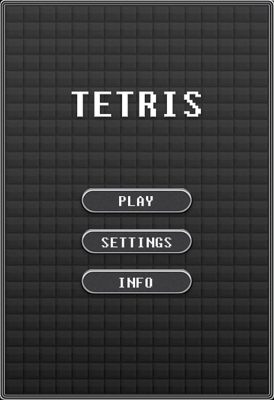
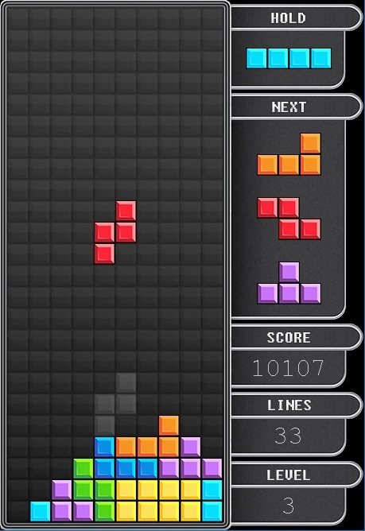
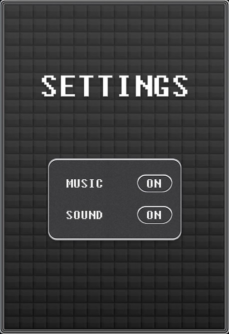
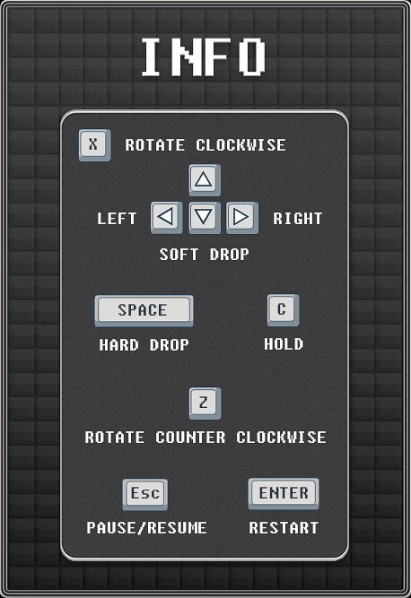

# Tetris
My first hobby project. I made this game alongside my studies during my first year at Chalmers in order to practice basic concepts of programming and MVC patterns.

## Desciption
Navigate with mouse. Click on screen to toggle between menu and gameplay or go back to menu from different view.

## GUI

